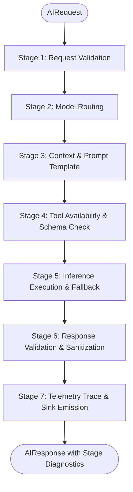

# NEXUS TITAN — AI Runtime Architecture & Specification

**Document Version:** 1.0.0  
**Phase:** Phase 2 — AI Runtime Foundation  
**Status:** Implemented & Verified Baseline  

---

## 1. Overview & Architectural Role

The **Central AI Runtime** (`ai/runtime/`) serves as the operational gateway between high-level user workflows (agents, RAG, tool calling) and underlying execution engines (local models, remote APIs, systems benchmarks).

Rather than calling models directly from route handlers or agent prompts, all AI requests are processed through an explicit, auditable **7-stage sequential pipeline** with strict Pydantic contract validation, automated model routing, and persistent telemetry tracking.

---

## 2. Request Lifecycle & The 7-Stage Pipeline



### Stage Responsibilities

1. **Stage 1 — Request Validation (`RequestValidationStage`)**:
   - Defensive validation of prompt text (rejects empty or whitespace-only inputs).
   - Validates `max_tokens` ($1 \le \text{tokens} \le 32768$) and execution budget limits.
2. **Stage 2 — Model Routing (`ModelRoutingStage`)**:
   - Queries `ModelRouter` to determine the target model, provider, and fallback candidate.
   - Evaluates explicit user preferences (`FAST`, `COMPLEX`, `LOCAL`, `AUTO`).
3. **Stage 3 — Context & Prompt Preparation (`ContextPreparationStage`)**:
   - Identifies if a versioned prompt template (`PromptTemplate`) was requested (`prompt_version="template_name:1.0.0"`).
   - Performs variable substitution and attaches declared system prompts.
4. **Stage 4 — Tool Availability Verification (`ToolAvailabilityStage`)**:
   - Interrogates `ToolRegistry` to ensure all requested tools are registered and valid.
5. **Stage 5 — Inference Execution & Fallback (`InferenceStage`)**:
   - Dispatches the validated request to the resolved `LLMProvider`.
   - **Automated Fallback**: If the primary provider raises a network or runtime exception, the stage automatically reroutes to the configured fallback model/provider, setting `fallback_used = True`.
6. **Stage 6 — Response Validation (`ResponseValidationStage`)**:
   - Validates output structure, token limits, and attaches provider provenance.
7. **Stage 7 — Telemetry Trace & Sink Emission (`TelemetryTraceStage`)**:
   - Captures high-resolution per-stage execution durations (`pipeline_timings_ms`).
   - Emits a structured `TelemetryTrace` record to the configured `TelemetrySink`.

---

## 3. Configurable Model Router (`ai/runtime/router.py`)

The `ModelRouter` decouples application logic from specific models and providers.

### Supported Routing Policies
1. **Explicit Model Selection**: Direct routing when a registered model identifier is explicitly requested.
2. **Preference-Based Routing**:
   - `RoutingPreference.FAST`: Routes to models flagged with `ModelCapability.FAST` (low latency, high throughput).
   - `RoutingPreference.COMPLEX`: Routes to models flagged with `ModelCapability.COMPLEX_REASONING`.
   - `RoutingPreference.LOCAL`: Routes to models marked `is_local = True` or `ModelCapability.LOCAL_PRIVATE`.
3. **AUTO Heuristic Routing**:
   - Analyzes prompt length ($>150$ words) and keywords (`benchmark`, `research`, `analyze`, `concurrency`, `deadlock`, `numerical`, `cache`).
   - If complex keywords are present $\to$ routes to `COMPLEX_REASONING`.
   - Else $\to$ routes to `FAST`.
4. **Fallback Resilience**:
   - Models can register a secondary fallback model (e.g. `mock-reasoning-v1` falls back to `mock-fast-v1`).
   - If a primary backend drops connections, the pipeline invokes the fallback seamlessly.

---

## 4. Versioned Prompt Template Engine (`ai/runtime/prompts.py`)

Prompts are treated as first-class, versioned engineering artifacts rather than ad-hoc inline strings:

```python
template = PromptTemplate(
    name="system_diagnosis",
    version="1.0.0",
    template_str="Analyze system anomaly on host '{hostname}':\nError: {log_excerpt}",
    system_prompt="You are an expert systems performance engineer.",
    description="Diagnoses OS and hardware anomalies from logs."
)
```

* **Variable Extraction**: Automatically parses `{variables}` using regex and guarantees all parameters are provided before inference.
* **Semantic Versioning**: Supports parallel coexistence of prompt versions (e.g. `1.0.0` and `1.1.0`), defaulting to the latest version if unspecified.

---

## 5. Telemetry & Metrics Aggregation (`ai/runtime/telemetry.py`)

NEXUS TITAN captures execution telemetry without guessing or simulating numbers:

### Telemetry Sinks
* **`InMemoryTelemetrySink`**: Thread-safe ring buffer retaining recent execution traces for real-time dashboard inspection.
* **`FileTelemetrySink`**: Persists every trace as an append-only JSONL record (`logs/traces/ai_traces.jsonl`) for reproducible evaluation and MLOps audit trails.
* **`CompositeTelemetrySink`**: Multi-casts traces to both memory and disk simultaneously.

### Runtime Metrics (`RuntimeMetricsAggregator`)
Calculates real-time operational statistics across recorded traces:
* Total requests, successful requests, and failed requests.
* Fallback activation count.
* Total input and output token consumption.
* Mean latency and 95th-percentile (p95) latency in milliseconds.
* Hardware mode (`CPU_ONLY` or `CUDA_ENABLED`).

---

## 6. API Endpoints

The FastAPI service exposes the AI Runtime via the following REST endpoints:

| Endpoint | Method | Description |
|---|---|---|
| `/health` | `GET` | Service status, version, and hardware mode |
| `/telemetry/hardware` | `GET` | Interrogates the compiled C++ hardware probe |
| `/ai/v1/models` | `GET` | Lists registered models, capabilities, and context windows |
| `/ai/v1/prompts` | `GET` | Lists registered versioned prompt templates |
| `/ai/v1/tools` | `GET` | Lists registered tools with schemas and approval requirements |
| `/ai/v1/runtime/execute` | `POST` | Submits prompt through the 7-stage pipeline |
| `/ai/v1/runtime/traces` | `GET` | Queries recent telemetry traces with filtering |
| `/ai/v1/runtime/metrics` | `GET` | Returns aggregated latency, token, and error statistics |

---

## 7. Verification Status

* **Automated Unit Tests**: 28 passing unit and integration tests across:
  - `tests/ai/test_router.py` (routing rules and fallbacks)
  - `tests/ai/test_prompts.py` (templating and versioning)
  - `tests/ai/test_pipeline.py` (7-stage pipeline and per-stage timings)
  - `tests/ai/test_telemetry.py` (JSONL persistence and p95 calculations)
  - `tests/ai/test_tools.py` (permission checks and approval gates)
  - `tests/ai/test_agent_state.py` (finite state machine transitions)
  - `tests/ai/test_api_endpoints.py` (FastAPI endpoints)
